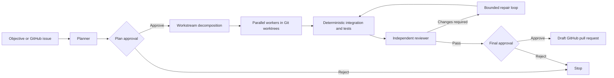
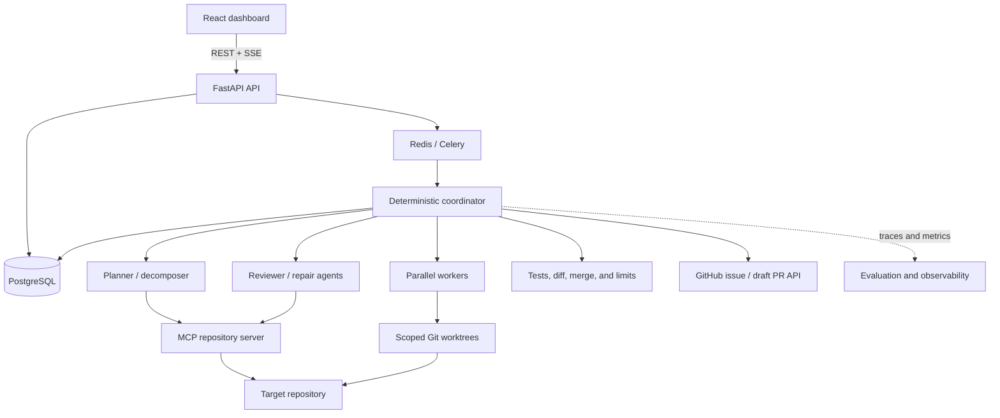

# Agentic Workbench

A human-governed, multi-agent software-engineering platform that turns an objective or GitHub issue into a planned, tested, independently reviewed code change and draft pull request.

It combines LLM judgment with deterministic orchestration: agents plan, implement, review, and repair, while application code owns permissions, workflow state, Git operations, tests, retry limits, and human approvals.

## Interface


## Workflow



## Technical Scope

| Area | Implementation |
|---|---|
| Frontend | React, TypeScript, Vite, Tailwind CSS, Zod |
| API | FastAPI, Pydantic, async SQLAlchemy, Alembic |
| Data | PostgreSQL for durable workflow, approval, execution, and artifact state |
| Agents | OpenAI Agents SDK with structured planner, worker, reviewer, and repair outputs |
| Connectivity | MCP client/server integration exposing repository tools, resources, and prompts |
| Isolation | Per-workstream Git worktrees with application-bound repository roots |
| Background execution | Celery workers with Redis as the broker; resumable execution from persisted state |
| Live updates | Server-sent events for workflow progress and approval status |
| Evaluation | Repeatable task suite comparing agent configurations across correctness, tests, latency, tokens, and cost |
| Delivery | GitHub issue intake and approved-result publication as a draft pull request |
| Engineering | Docker Compose, `uv`, Pytest, Ruff, Vitest, ESLint, and GitHub Actions |

## Architecture



## Key Engineering Decisions

- **Deterministic control plane:** Python state transitions—not another model—control execution order, retries, timeouts, merges, cleanup, and terminal outcomes.
- **Human-in-the-loop safety:** plans, protected tool calls, and final publication pause for persisted approval decisions and resume from serialized state.
- **Parallel isolation:** independent workstreams execute concurrently in separate Git worktrees, then merge into an integration worktree for combined testing and review.
- **Scoped capabilities:** repository roots, fixed command allowlists, path validation, tool approvals, and bounded agent/review loops limit autonomous actions.
- **Measured architecture:** an eval harness compares single-agent and multi-agent configurations using deterministic checks before optional model-based judgment.

## Durable Execution

Workflow state is persisted independently of model conversations. FastAPI creates and controls runs, Celery performs long-running work, PostgreSQL remains the source of truth, and Redis transports queued work. A stopped worker can reload the last completed stage without repeating completed work; SSE only reports progress to the browser.

## Local Development

### Requirements

- Docker with Compose
- Git
- OpenAI API key
- GitHub token for issue and draft-PR integration

```bash
git clone https://github.com/nikomayra/agentic-workbench.git
cd agentic-workbench
cp .env.example .env
docker compose up --build
docker compose exec backend uv run alembic upgrade head
```

- Frontend: `http://localhost:5173`
- API documentation: `http://localhost:8000/docs`

For backend-only development and environment assumptions, see [`backend/README.md`](backend/README.md).

## Quality Checks

```bash
cd backend && uv run pytest && uv run ruff check .
cd frontend && npm run test && npm run lint && npm run build
```

The test suite covers deterministic workflow transitions, approval rejection, bounded repair, worktree integration and cleanup, MCP calls and repository-boundary enforcement, durable resume behavior, and eval scoring.
